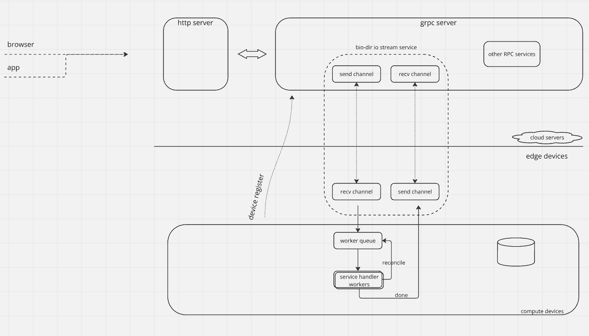

# GitHub Agent

GitHub Agent is an open-source AI-based tool designed for developers and project managers to efficiently track and manage updates in subscribed GitHub repositories. By providing regular (daily/weekly) summaries, GitHub Agent helps teams stay informed on project progress, enabling faster responses and more effective collaboration.

## Features

- **Subscription Management**: Easily manage GitHub repository subscriptions.
- **Update Fetching**: Automatically fetch the latest updates from subscribed repositories.
- **Notification System**: Notify users of new updates via email, Slack, etc.
- **Report Generation**: Generate regular update reports (daily/weekly) to keep track of project changes.

## Design
为了充分利用边缘算力，设计架构如下：  


应用开发架构示例：  



## Installation

1. Clone the repository:

   ```bash
   git clone https://github.com/axpz/githubAgent.git
   cd githubAgent
   ```

2. Activate your Python environment:

   ```bash
   source ~/python/env/jupyter/bin/activate
   ```

3. Install dependencies:

   ```bash
   pip install -r requirements.txt
   ```

## Usage

1. Set up your repository subscriptions: Use the subscription management module (subscription.py) to add or remove repositories you want to track.

2. Run GitHub Agent: To start fetching updates and generating reports, run:

   ```bash
   bash main.sh start
   ```

3. Configure Notifications: Adjust the notifier.py module to set up your preferred notification channels (e.g., email, Slack).

4. Generate Reports: The agent will automatically generate reports at the specified intervals. You can find the generated report in `update_report.json`.

## Contributing

Contributions are welcome! If you would like to improve GitHub Agent, please feel free to fork the repository and submit a pull request.

## Testing

To run tests, use:

```bash
pytest
```

## Star History

[](https://star-history.com/#axpz/githubAgent&Date)

## License

This project is licensed under the MIT License. See the [LICENSE](LICENSE) file for details.

## Contact

For any questions or suggestions, please open an issue or contact the repository owner.
