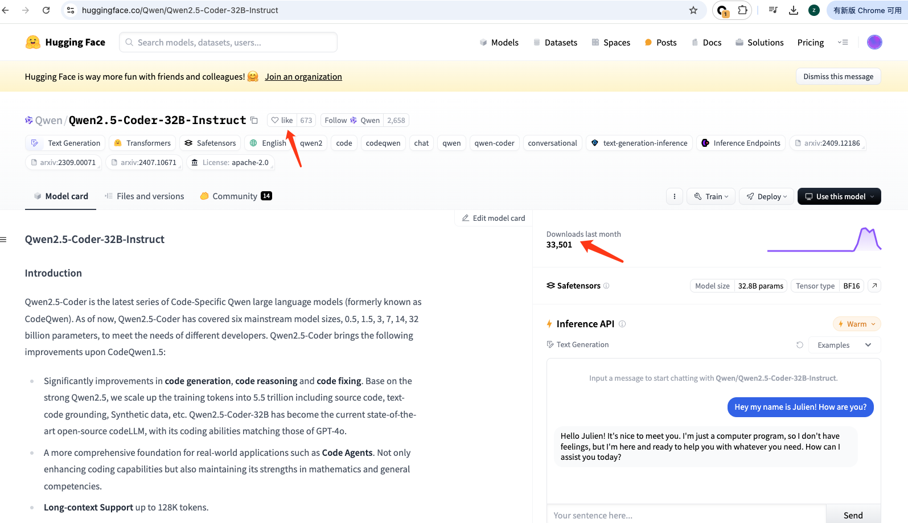

# Requirement todo
1. 基于https://ollama.com/search 实现一个 pull-history 的功能类似 star-history
2. 基于huggenface 实现一个like history star和pull-history的功能
3. Watch github repos: ollama, exo, open-webui, huggenface, langchain, vllm